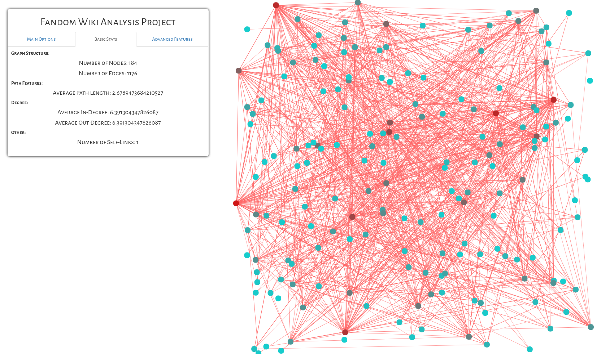

# [noHALFnoLIFE: Fandom Wiki Analysis](https://MattLi96.github.io/noHALFnoLIFE/)
by [Austin Liu](https://github.com/aliu139), [Jared Wong](https://github.com/techlover10), [Matthew Li](https://github.com/MattLi96), and [Kevin Jiang](https://github.com/kzj1995)

## Introduction
This is the visualization portion of our final project for CS6850: The Structure of Information Networks with J. Kleinberg. After generating all of the data using our Python backend, we built this visualization to get a better sense of the overall structure of the networks that we were analyzing. 

## Tabs
* Main Options:
    * Choose the dataset you want to analyze!
    * Turn the network into a force-directed graph with the Dance button!
    * Toggle labels for each individual node
    * Hide all nodes except the focused neighborhood with Component Mode!
* Basic Stats:
    * Get an overview of the graph with basic statistics on 
        * Number of Nodes/Edges
        * Average Path Length
        * Average In/Out Degree
        * ... and more!
* Advanced Features:
    * Search for specific nodes in the wiki
    * See the network throughout time with the Time Analysis slider!
    * See how the network reacts when we remove the highest degree nodes using the Node Removal Button!

## Features
* Zoom in and out of the graph using the scroll wheel!
* Pan by dragging the screen!
* Drag nodes into any position you want!
* Click on a node to highlight it (in black) and visualize its neighborhood!
* Click on two different nodes to find the path in between them!

## Credits
* Sigma.js
* VueJS
* Underscore